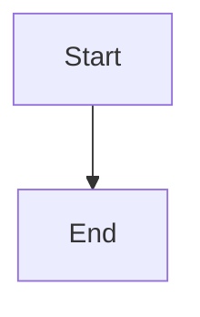

# RoadKit 🛣️

A powerful toolkit for creating drafts and technical content with modern tools.

## Features ✨

- 📝 **Markdown Support**: Clean and simple text formatting
- 📊 **Mermaid Integration**: Create elegant diagrams and flowcharts
- 🔢 **Mathematics Support**:
  - Typst for mathematics
- **P5js** for drawing
- 🌳 **Smart Navigation**: Automatic TreeSideBar generation
- 🇻🇳 **Unicode Support**: Full compatibility with Vietnamese characters and spaces in paths

## Getting Started 🚀

```bash
# Clone the repository
git clone https://github.com/anthule123/roadkit.git

# Install dependencies
npm install

# Start development server
npm run dev
```

## Usage 💡

1. Create content using Markdown:
```markdown
# Your Title
Your content here...
```

2. Add diagrams with Mermaid:




3. Insert simple math blocks with Typst:
```math
vec(a/b, a/b, a/b) = vec(1, 1, 1)

```

## Documentation 📚

Visit our [documentation](https://your-docs-link.com) for detailed guides and examples.

## License 📄

MIT License - see [LICENSE](LICENSE) for details

## Contributing 🤝

Contributions are welcome! Please read our [contributing guidelines](CONTRIBUTING.md).

---

Built with ❤️ using [Next.js](https://nextjs.org/)
