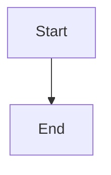

# DraftKit 

A toolkit for creating hypertext drafts and content. This isn't as good as your
pulp-based paper, though.

## Features ✨

- 📝 **Markdown Support**
- 📊 **Mermaid Integration**: Create elegant diagrams and flowcharts
- 🔢 **Mathematics Support**: Typst
- **P5js** for drawing
- 🌳 **Smart Navigation**: Automatic TreeSideBar generation
- 🇻🇳 **Unicode Support**: Full compatibility with Vietnamese characters and spaces in paths

## Getting Started 🚀

```bash
# Clone the repository
git clone https://github.com/anthule123/draft-kit.git

# Install dependencies
npm install
npx install playwright

# Start development server
npm run dev
```

## Usage 💡

1. Create content using Markdown:
```markdown
# Your Title
Your content here...
```

2. Add diagrams with Mermaid:




3. Insert simple math blocks with Typst:
```math
vec(a/b, a/b, a/b) = vec(1, 1, 1)
``` 
