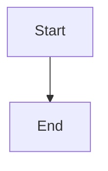

# DraftKit 

A toolkit for creating hypertext drafts and content. This isn't as good as your
pulp-based paper, though.

## Features ✨
**📝 Markdown Support**:

**🌳 Smart Navigation**: Automatically generates a TreeSidebar from the folder structure.
- Just create any .mdx file inside src/content/blog, and it will show up in the sidebar tree structure.


🇻🇳 **Unicode Support**: Full support for Vietnamese characters - including accents and spaces in file and folder paths.

🌐 **Bilingual Web**: Make web in both Vietnamese and English 

📘 **One-Click PDF Book Export**: Generate a full-site PDF version
 of your content with just one click — preserving markdown 
 formatting, headings, and layout.
- 🔧 Works in local or dynamic web environments only.

🕒 **Timeline Post List**: Displays blog posts in a chronological timeline, 
just like a traditional blog.
- 📌 Requires metadata fields (e.g., date, title, tags) defined in each post's frontmatter.


📊 **Mermaid** Integration: Create elegant diagrams and flowcharts. 

🔢 **Mathematics Support (Typst)**

🎨 **P5.js Drawing**: Embed and interact with P5.js sketches right inside your posts — perfect for visual demos and generative art.

## Getting Started 🚀

```bash
# Clone the repository
git clone https://github.com/anthule123/draft-kit.git

# Install dependencies
npm install
npx install playwright

# Start development server
npm run dev
```

## Usage 💡

1. Create content using Markdown:
```markdown
# Your Title
Your content here...
```

2. Add diagrams with Mermaid:




3. Insert simple math blocks with Typst:
```math
vec(a/b, a/b, a/b) = vec(1, 1, 1)
``` 
